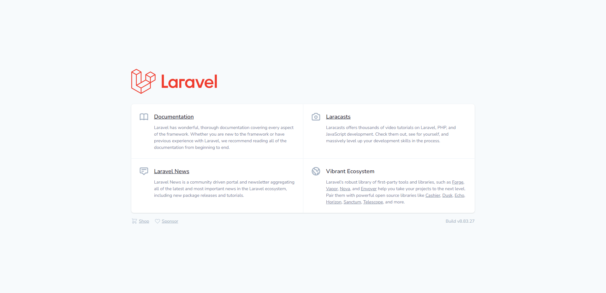
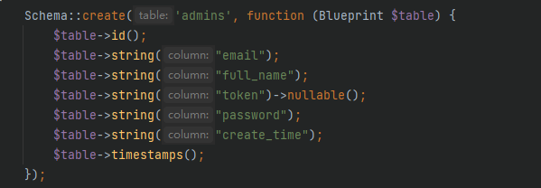
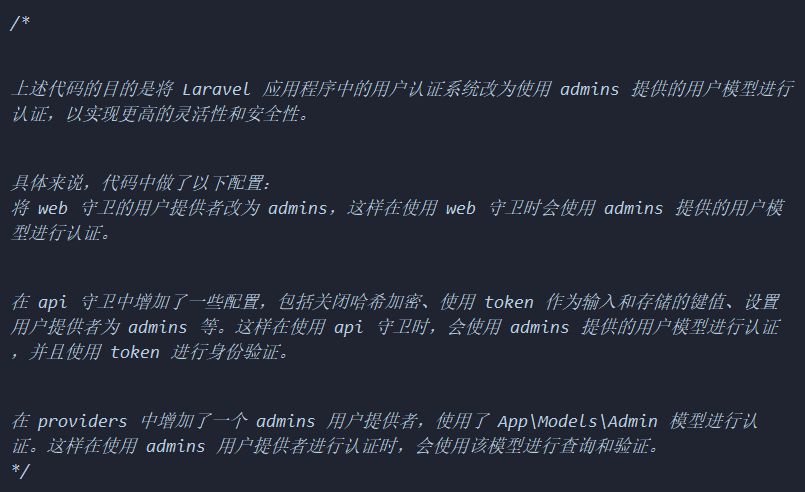
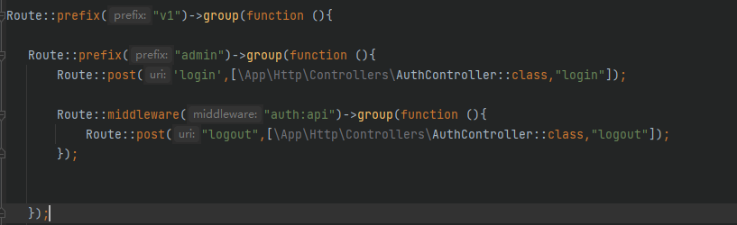
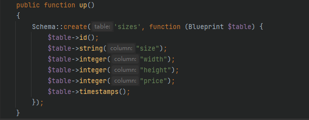
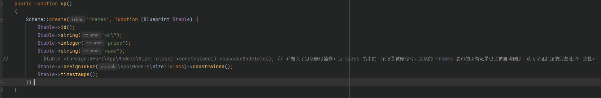
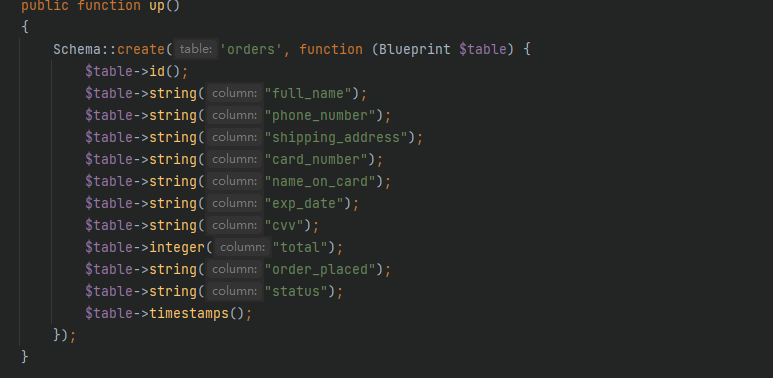
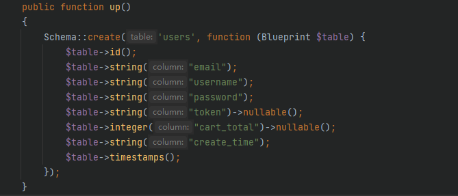
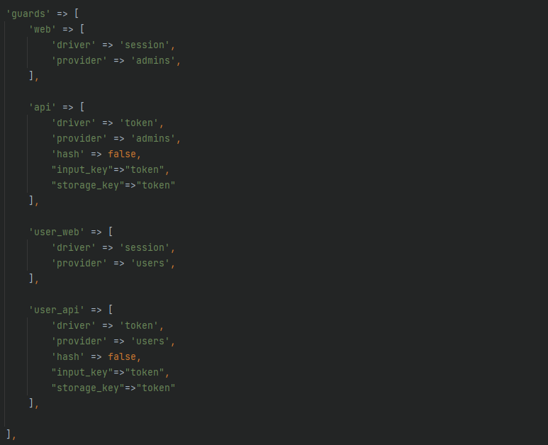
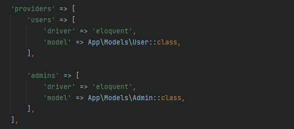

# TestProject

## 一. Laravel目录结构组成

```
其中 app目录是程序的核心代码,包括控制器、模型、服务提供者等;

config 目录是包括应用程序的配置文件,例如 数据库、缓存、邮件等;

database 目录包括数据相关的文件,例如迁移文件、种子文件等;

public 目录包括公共文件,例如前端资源、入口文件等;

routes 目录包括应用程序的路由文件(这里面写api的地址);

resources 目录包括应用程序的资源文件，例如视图、语言包、前端资源等;

storage 目录包括应用程序的存储文件，例如日志、缓存、会话等;

tests 目录包括应用程序的测试文件;

vendor 目录包括 Composer 依赖的第三方库。
```

## 二.启动

首先打开集成工具 XAMPP,把apache和mysql功能全部打开;

然后找到XAMPP的目录把我们的laravel放到里面的htdocs文件夹下,然后打开127.0.0.1就可以到laravel了点击如果可以看到laravel的页面就说明启动成功了



## 三.项目配置

第一步 先在.env文件里面把数据库配置好

数据库名字 和 账号密码 写自己的

```
DB_CONNECTION=mysql
DB_HOST=127.0.0.1
DB_PORT=3306
DB_DATABASE=laravel
DB_USERNAME=root
DB_PASSWORD=root
```

第二步 可以看到项目完成的api地址是没有/public那一层的,这样的话我们就需要把laravel的入口文件index.php从public目录里面提取出来,直接放在最外面,切记要把index.php里面的引入路径地址更换一下(需要去掉一层)

index.php 其实就是我们的入口文件,只要访问它就能帮我们做事情,但是要记得把里面引用路径跟随者index.php的位置而更改

然后配置基本完成可以进行下一步了

## Management Panel API

### Auth

#### a. Login

##### 1. 初始化
在控制台输入以下指令
``` 

php artisan make:controller AuthController
php artisan make:model Admin -m

```
这将在 app/Http/Controllers/ 目录下创建一个名为 AuthController.php 的控制器，并在 app/Models/ 目录下创建一个名为 Admin.php 的模型。

然后在模型中将数据改为以下内容：
```php

<?php

namespace App\Models;

use Illuminate\Database\Eloquent\Factories\HasFactory;
use Illuminate\Foundation\Auth\User;
use Illuminate\Notifications\Notifiable;

class Admin extends User
{
    use HasFactory, Notifiable;

    protected $fillable = [
        "email", "full_name", "password"
    ];

    function getCreatedAtAttribute($t){
        return $t;
    }

}
```
在迁移文件里找到 admins的
 
" 这里面的create_time 应该是不需要的 "
 php artisan migrate:refresh  进行回滚所有数据库迁移


在 database/Seeders/DatabaseSeeder.php 中添加以下内容以向数据库添加数据：
```php
use App\Models\Admin;
use Illuminate\Database\Seeder;
use Illuminate\Support\Facades\Hash;

class DatabaseSeeder extends Seeder
{
    public function run()
    {
        Admin::create([
            "email"=>"admin@eaphoto.com",
            "full_name"=>"admin",
            "password"=>Hash::make("admin")
        ]);
    }
}
```
最后执行以下命令以生成定义的数据：
```php

php artisan db:seed
```

##### 2. 配置 Auth
打开 config/auth.php 文件，将 web 守卫的提供者改为 admins，并在 api 守卫中添加以下配置：

```php
'guards' => [
    'web' => [
        'driver' => 'session',
        'provider' => 'admins',
    ],

    'api' => [
        'driver' => 'token',
        'provider' => 'admins',
        'hash' => false,
        "input_key"=>"token",
        "storage_key"=>"token"
    ],
],
```
在 providers 中，我们需要添加一个 admins 用户提供者，使用 App\Models\Admin 模型进行认证。
```php

'admins' => [
    'driver' => 'eloquent',
    'model' => App\Models\Admin::class,
],
```


##### 3. 登录方法
在 AuthController.php 中编写以下 login 方法：
```php
/*
use Illuminate\Http\Request;
use Illuminate\Support\Facades\Auth;
use Illuminate\Support\Facades\Validator;
*/
// Request就是前端的请求体
 function login(Request $request)
{
    $data = $request->only('email', 'password');
    // Validator是laravel自带的校验里面有很多定义好的规则
    $val = Validator::make($data, [
        'email' => 'required|email',
        'password' => 'required',
    ]);

    // 如果有错误
    if ($val->fails()) {
        return response()->json([
            'msg' => "data cannot be processed"
        ], 422);
    }

   // 用laravel的自带校验去验证账号密码
  if (Auth::attempt($data)) {
      $user = Auth::user(); // 取出当前用户信息
      $user->token = md5($user->email);
      $user->save();

      return response()->json([
          'msg' => 'success',
          'data' => [
              'id' => $user->id,
              'email' => $user->email,
              'full_name' => $user->full_name,
              'token' => $user->token,
              'created_at' => $user->created_at,
          ]
      ]);
  }

    return response()->json([
        "msg"=>"user credentials are invalid"
    ], 401);
}

```

##### 4. 路由
在 routes/api.php 中编写以下路由：

```php
/*
prefix("") 就是用来增加前缀的
*/
// 统一增加v1前缀
Route::prefix("v1")->group(function (){

  // 统一增加admin前缀
  Route::prefix("admin")->group(function (){
    // post:就是调用接口的方式,[这里是controller里面的控制类,"这里是里面方法名"]
     Route::post('login',[\App\Http\Controllers\AuthController::class,"login"]);
  }

}
```

#### b. Logout

##### 1. 登出方法
在 AuthController.php 中编写 logout 方法，将用户的 token 设为 null，并保存用户信息。
```php
// logout
function logout(){
  // 通过认证获取当前的用户
    $user = Auth::user();
    // 把token赋值为null
    $user->token = null;
    // 调用保存
    $user->save();
    return response()->json([
        "msg"=>"success"
    ]);
}
```


##### 2. 路由
在 routes/api.php 中添加登出路由，并使用 auth:api 中间件保护。
```php
   /*
   auth:api 中间件是 Laravel Passport 所提供的中间件，用于保护 API 路由
   api是我们在auth.php 认证守卫(guards)里面写的
   */
  
  // 方法1: 每个都用中间件
Route::post("logout",[\App\Http\Controllers\AuthController::class,"logout"])->middleware("auth:api");

// 方法2: 将中间件用group包起来统一处理
Route::middleware("auth:api")->group(function (){

  Route::post("logout",[\App\Http\Controllers\AuthController::class,"logout"]);

});

```
ps:


##### 3. 处理 401 错误
在 app/Exceptions/Handler.php 中，统一捕获 401 错误并返回 unauthorized。
```php
/*
打开Handler.php 找到register函数
我们可以在app/Exceptions/Handler.php 统一捕获没有token的错误然后返回401

use Illuminate\Auth\AuthenticationException; 权限的异常

*/

// 方法1(捕捉单个错误):
  // 捕捉单个身份验证失败的情况
  $this->renderable(function (AuthenticationException $e){
            return response()->json([
                "msg"=>"unauthorized"
            ],401);
  });

// 方法2(捕捉所有错误):
  // 捕捉所有的情况
  $this->renderable(function (\Exception $e){
    // 然后判断是不是身份失败的情况
      if($e instanceof AuthenticationException){
          return response()->json([
                "msg"=>"unauthorized"
            ],401);
      }
  });

```

### Size

#### a. Get All Sizes 接口
##### 1. 初始化
创建控制器和模型
```php

php artisan make:controller SizeController
php artisan make:model Size -m
```
-m 的意思是默认创建数据库迁移文件

##### 2. 数据库
在 database/migrations 目录下找到新创建的迁移文件，在 up 方法中编写字段信息：


php artisan migrate:refresh  进行回滚所有数据库迁移

在 database/Seeders/DatabaseSeeder.php 文件中，使用 Size 模型创建初始数据：
```php
Size::create([
      "size"=>"1 Inch",
      "width"=>2.5,
      "height"=>3.6,
      "price"=>10
  ]);

  Size::create([
      "size"=>"2 Inch",
      "width"=>3.4,
      "height"=>5.2,
      "price"=>15
  ]);

  Size::create([
      "size"=>"3 Inch",
      "width"=>5.5,
      "height"=>8.4,
      "price"=>60
  ]);

  Size::create([
      "size"=>"5 Inch",
      "width"=>8.9,
      "height"=>12.7,
      "price"=>70
  ]);

  Size::create([
      "size"=>"6 Inch",
      "width"=>10.2,
      "height"=>15.2,
      "price"=>100
  ]);

  Size::create([
      "size"=>"7 Inch",
      "width"=>12.7,
      "height"=>17.8,
      "price"=>120
  ]);

  Size::create([
      "size"=>"8 Inch",
      "width"=>15.2,
      "height"=>20.3,
      "price"=>120
  ]);
```
然后执行：
```php

php artisan db:seed
```

ps: 关于金额用的都是integer,然后存的时候把价格*100,取的时候在/100 这样不容易出问题

##### 3. 获取尺寸方法方法

```php
   function getAllSize(){
    // 获取所有 Size 模型实例
    $size = Size::all()->map(function ($item){
      // 使用map方法讲价格除以100 方便前端展示
        $item->price /= 100;
        return $item;
    });
    // 返回 JSON 格式的响应，包括成功信息和所有 Size 实例
    return response()->json([
        "msg"=>"success",
        "data"=> $size
    ]);
   }
```

##### 4.路由
   
```php

Route::get("size",[\App\Http\Controllers\SizeController::class,"getAllSize"]);
```
#### b.Update Size 接口

##### 1. 更新尺寸方法

```php
  // $id 是路由传过来的参数
  function updateSize(Request $req,$id){
      // 查找指定 ID 的 Size 实例
      $size = Size::find($id);
      // 如果未找到该实例，返回 404 错误响应
      if (!$size) return response()->json(["msg"=>"not found"],404);
      // 如果价格小于 0，返回 422 错误响应
      if($req->get("price") < 0) return response()->json([],422);
      // 更新 Size 实例的价格
      $size->update(["price"=>$req->get("price")*100]);
      // 返回 JSON 格式的响应，包括成功信息和更新后的 Size 实例
      return response()->json([
          "msg"=>"success",
          "data"=>$size
      ]);
 }
```

##### 2. 路由
patch方法  /{size_id}:就是要传给函数的id   
```php

Route::patch("size/{size_id}",[\App\Http\Controllers\SizeController::class,"updateSize"]);
```

### Frame

#### a.Get All Frames 

##### 1. init
   php artisan make:controller  FrameController
   php artisan make:model Frame -m

##### 2. 数据库


```php
Schema::create('frames', function (Blueprint $table) {
      $table->id();
      $table->string("url");
      $table->integer("price");
      $table->string("name");
      // 创建外键字段(默认为size_id)，关联 sizes 表中的记录(默认与sizes表的主键)
      $table->foreignIdFor(\App\Models\Size::class)->constrained();
      $table->timestamps();
});
/*
通过创建外键字段，确保 frames 表中的每条记录都关联到了 sizes 表中的一条记录，从而保证数据的完整性和一致性。
注意，可以使用级联删除操作，当 sizes 表中的一条记录被删除时，关联的 frames 表中的所有记录也会被自动删除。

cascadeOnDelete(); 这个方法可以自己去看一下
*/
```

##### 3. 获取方法
在FrameController.php写入getAllFrame方法

```php
   // 方法1 ->
 function getAllFrame(){
    $frames = Frame::all()->map(function ($item){
        $item->size = Size::find($item->size_id)->size;
        $item->price /=100;
        return $item;
    });

    return  response()->json([
      "msg"=>"success",
      "data"=>$frames
  ]);
 }

  // 方法2 ->
  function getAllFrame(){
      // 获取所有相框
      $frames = Frame::join("sizes","frames.size_id","=","sizes.id")->select("frames.id","frames.url","frames.price","frames.name","sizes.size")->get()->map(function ($item){
          $item->price /=100;
          return $item;
      });
    return  response()->json([
        "msg"=>"success",
        "data"=>$frames
    ]);
  }
```

##### 4. 路由

```php

Route::get("frame",[\App\Http\Controllers\FrameController::class,"getAllFrame"]);

```

#### b. Update Frame 

##### 1. 更新方法
 在FrameController.php写入updateFrameById方法
```php
  function updateFrameById(Request $req,$id){
    // 根据id 查询相框
    $frame = Frame::find($id);
    // 如果相框不存在
    if(!$frame) return response()->json(["msg"=>"not found"],404);
    // 更新相框的价格和名称
    $frame->update(["price"=>$req->get("price")*100,"name"=>$req->get("frame_name")]);
    // 返回响应
    return response()->json(["msg"=>"success","data"=>$frame]);
  }
```

##### 2. 路由

```php
Route::patch("frame/{frame_id}",[\App\Http\Controllers\FrameController::class,"updateFrameById"]);
```

### Order

#### a. Get All Orders
##### 1. 初始化
```php

php artisan make:controller OrderController
php artisan make:model Order -m
```

##### 2. 数据库
  
  
  可以增加几个订单数据 这里关联到了photo所以需要把photo初始化也做出来
  php artisan make:controller PhotoController
  php artisan make:model Photo -m

```php
    Schema::create('photos', function (Blueprint $table) {
          $table->id();
          $table->string("edited_url")->nullable();
          $table->string("original_url")->nullable();
          $table->string("framed_url")->nullable();
          $table->foreignIdFor(\App\Models\Frame::class)->nullable()->constrained();
          $table->foreignIdFor(\App\Models\Size::class)->constrained();
          $table->integer("user_id");
          $table->foreignIdFor(\App\Models\Order::class)->nullable()->constrained();
          $table->string("status");
          $table->timestamps();
      });

 /*
  $table->foreignIdFor(\App\Models\Frame::class)->nullable()->constrained();

  foreignIdFor 方法用于在当前数据库创建一个外键,该方法的传参是一个模型类名,表示要关联的模型 
  例如: 
  $table->foreignIdFor(\App\Models\Frame::class);
  表示在当前数据表创建一个外键字段,用于关联Frame模型的主键字段, 也可以加第二参数用于指定名称 $table->foreignIdFor(\App\Models\Frame::class,"XXX");

  nullable 方法就是指定该字段可以为空

  constrained 方法用于将外键字段与关联模型的主键,确保外键字段的值必须存在于关联模型的主键字段中 
  可以传入两个参数 分别是关联模型的表名和主键字段
  例如:
  $table->foreignIdFor(\App\Models\User::class)->constrained('users', 'user_id')表示将当前数据表中的外键字段与users表的user_id字段进行约束。

  不传参数的话就会将外键字段与关联模型的主键字段进行约束  
 */
```
然后 php artisan migrate:refresh 

创建一些具有照片关联的订单数据。
DatabaseSeeder.php
```php
     Order::create([
           "full_name"=>"Matthew",
           "phone_number"=>"10001000",
           "shipping_address"=>"Where",
           "card_number"=>"3223222222",
           "name_on_card"=>"Matthew XXX",
           "exp_date"=>'2023-05-16',
            "cvv"=>"246",
            "total"=>0,
            "order_placed"=>'2023-05-16 13:58',
            "status"=>"Valid"
        ]);

        
        Photo::create([
            "edited_url"=>null,
            "original_url"=>"http://127.0.0.1/laravel/public/storage/VqSXFxX6svX0ftga8GXhp2Wj83ahAfCklNhhz8C##### 5.jpg",
            "framed_url"=>"http://127.0.0.1/laravel/public/storage/q7DQnDLIlBIYMFhIIW6CJZObTxoAcdROii1sFCpz.png",
            "status"=>"order",
            "order_id"=>1,
            "frame_id"=>2,
            "size_id"=>2,
            "user_id"=>1
        ]);

        Photo::create([
            "edited_url"=>null,
            "original_url"=>"http://127.0.0.1/laravel/public/storage/VqSXFxX6svX0ftga8GXhp2Wj83ahAfCklNhhz8C##### 5.jpg",
            "framed_url"=>"http://127.0.0.1/laravel/public/storage/q7DQnDLIlBIYMFhIIW6CJZObTxoAcdROii1sFCpz.png",
            "status"=>"order",
            "order_id"=>2,
            "frame_id"=>2,
            "size_id"=>2,
            "user_id"=>1
        ]);
```

生成数据 
```php
php artisan db:seed
```


##### 3. 获取订单方法 

在OrderController.php里面写入 getAllOrders方法
```php
/*
写之前需要在Order模型里面做以下操作

这里用到了一个 一对多的知识点
订单就好比是一个博客的文章,然后图片就好比是文章的评论
一个文章有好多个评论
1对多
1就是订单
多就是图片
*/

// 要在Order的模型里面写入一个方法 表示该模型拥有多个photo模型对象,即一对多

public function photos(){
  return $this->hasmany(Photo::class);
} 

```

``` php

// 这个方法会导致n+1问题,影响性能
    function  getAllOrders(){
      // 使用with方法 预加载订单里面所有照片的信息
        $orders = Order::with("photos")->get();
        // 遍历每个订单里面的所有照片,并查询相关的相框和尺寸
        foreach ($orders as $item){
            // 定义一个总数
            $total = 0;
            foreach ($item->photos as $child){
              // 如果有相框 则查询相框信息，并更新到照片对象中
                if($child->frame_id){
                    $frame = Frame::find($child->frame_id);
                    $child->frame_price = $frame->price/100;
                    $child->frame_name = $frame->name;
                    
                }else{
                  // 如果照片没有关联相框，则设置相框价格为 0，相框名称为 "no frame"
                    $child->frame_price = 0;
                    $child->frame_name = "no frame";
                }
                // 查询照片关联的尺寸信息，并更新到照片对象中
                $size = Size::find($child->size_id);
                $child->size = $size->size;
                $child->print_price = $size->price/100;
                total += $child->print_price + $child->frame_price;
            }
        }
        unset($item);
        return  response()->json([
            "msg"=>"success",
            "data"=>$orders
        ]);
    }
```

##### 4. 路由
```php
Route::get("order",[\App\Http\Controllers\OrderController::class,"getAllOrders"]);
```


#### b. Cancel Order

##### 1. 取消订单方法
OrderController.php
``` php
  function cancelOrderById($id){
      // 查询状态为"Valid"且ID为指定值的订单
      $order = Order::where("status","Valid")->where("id",$id)->get();
      // 如果没有找到对应的订单，则返回404状态码和错误信息
      if(!count($order)) return response()->json(["msg"=>"not found"],404);
      // 将订单状态更新为"Cancel"
      $order[0]->update(["status"=>"Cancel"]);
      return  response()->json(["msg"=>"success"]);
  }
```

##### 2. 路由
```php

Route::post("order/cancel/{order_id}",[\App\Http\Controllers\OrderController::class,"cancelOrderById"]);
```


#### c. Complete Order

##### 1. 完成订单方法
OrderController.php
``` php
  function completeOrderById($id){
    // 查询状态为"Valid"且ID为指定值的订单
      $order = Order::where("status","Valid")->where("id",$id)->get();
       // 如果没有找到对应的订单，则返回404状态码和错误信息
      if(!count($order)) return response()->json(["msg"=>"not found"],404);
      // 将订单状态更新为"Complete"
      $order[0]->update(["status"=>"Complete"]);
      return  response()->json(["msg"=>"success"]);
  }
```

##### 2. 路由

```php

Route::post("order/complete/{order_id}",[\App\Http\Controllers\OrderController::class,"completeOrderById"]);
```


### User

#### a. Get All Users

##### 1. 初始化
```php
php artisan make:controller UserController
php artisan make:model User -m 
// (这里可以不执行,因为laravel自带了一个User模型)
```

##### 2. 数据库



然后 php artisan migrate:refresh 

创建一些用户数据
DatabaseSeeder.php
```php
  User::create([
      "email"=>"user@eaphoto.com",
      "username"=>"sample_user",
      "password"=>Hash::make("user"),
      "cart_total"=>300,
      "create_time"=>"2023-05-16 11:12",
  ]);

  User::create([
      "email"=>"us3er@eaphoto.com",
      "username"=>"sample_user",
      "password"=>Hash::make("user"),
      "cart_total"=>300,
      "create_time"=>"2023-05-16 11:12",
  ]);
```
生成数据
```php

php artisan db:seed
```
##### 3. 获取方法
UserController.php
``` php

 function getAllUsers(){
      $users = User::all(); //获取所有用户
      return response()->json([
          "msg"=>"success",
          "data"=> $users
      ]);
  }
```

##### 4. 路由
``` php
Route::get("user",[\App\Http\Controllers\UserController::class,"getAllUsers"]);
```

#### b. Reset User Password

##### 1. 重置方法
```php
  function resetUserById($id){
    // 查询到要修改的用户
      $user = User::find($id);
      // 如果没有找到则返回404
      if(!$user) return response()->json(["msg"=>"not found"],404);
      // 调用我们在controller里面定义的方法
      $pwd = $this->randPassword(8);
      // 更新密码字段
      $user->update(["password"=> Hash::make($pwd)]);
      // 返回前端的数据
      return response()->json([
          "msg"=>"success",
          "data"=>[
          "id"=>$user->id,
          "password"=>$pwd
        ]
      ]);
  }


  // Controller里面的重置方法
  function randPassword($count = 8){
      $str = "qwertyuiopasdfghjklzxcvbnm123456789QWERTYUIOPASDFGHJKLZXCVBNM";
      $pwd = '0';
      for ($i=0;$i<$count-1;$i++){
          $pwd .= $str[rand(0,strlen($str)-1)];
      }
      return $pwd;
  }
```

##### 2. 路由
``` php

Route::post("user/reset/{user_id}",[\App\Http\Controllers\UserController::class,"resetUserById"]);
```


#### c. Delete a User

##### 1. 删除用户方法

``` php

  function deleteUserById($id){
    // 查询用户
      $user = User::find($id);
      // 没有就返回404
      if(!$user) return response()->json(["msg"=>"not found"],404);
      // 调用删除
      $user->delete();
      // 返回
      return  response()->json(["msg"=>"success"]);
  }
```

##### 2. 路由

```php

Route::delete("user/{user_id}",[\App\Http\Controllers\UserController::class,"deleteUserById"]);
```


#### d. Reset a User's Cart

##### 1. 重置用户购物车方法

``` php
/*
首先在这里  购物车的表我们把它当做photos表
这个表我们在写 Order方法的时候就已经建立了
里面的status有三种状态 uploaded(上传中) cart(购物车中) order(订单中)
*/

  function resetUserCartById($id){
    // 查找用户
      $user = User::find($id);
      // 没有就返回404
      if(!$user) return response()->json(["msg"=>"not found"],404);
      // 购物车数量置空
      $user->update(['cart_total' => null]);
      // 去photo里面找到自己的并且是购物车状态的 然后删除
      Photo::where("user_id",$id)->where("status","cart")->delete();
      // 响应
      return response()->json([
          "msg"=>"success"
      ]);
  }
```

##### 2. 路由
``` php

Route::post("cart/reset/{user_id}",[\App\Http\Controllers\UserController::class,"resetUserCartById"]);
```


### Admin

#### a. Get All Admins

##### 1. 获取所有管理员方法
```php

 function getAllAdmins(){
    return response()->json([
        "msg"=>"success",
        // all 里面的是要查出来的字段
        "data"=>Admin::all("id","email","full_name","created_at")
     ]);
  }
```

##### 2. 路由
```php

Route::get("admin",[\App\Http\Controllers\AdminController::class,"getAllAdmins"]);
```

#### b. Create Admin

##### 1. 创建管理员方法
``` php
/*
这里就需要用到$fillable
在Admin模型里面写入

protected $fillable = [
   "email","full_name","password","create_time"(这个要是前面创建数据库的时候没有加就省略掉 包括下面用到的时候也可以省略掉)
];


use Illuminate\Support\Facades\Hash;  加密用的
use Illuminate\Support\Facades\Validator;  校验用的

*/
    function createAdmin(Request $req){
        // 获取请求中的数据
        $data = $req->only("email","full_name","password","repeat_password");
        // 使用 Laravel 自带的 Validator 类进行验证
        $val = Validator::make($data,[
            "email"=>"required|email|unique:admins",
            "full_name"=>"required",
            "password"=>"required",
            "repeat_password"=>"required|same:password",
        ]);

        if($val->fails()){
            $errorMsg = $val->errors()->first() =='The email has already been taken.' ?"email has already been used" :"data cannot be processed";
             // 如果email已经被使用，则返回email has already been used，否则返回data cannot be processed
        return response()->json([
                    "msg"=>$errorMsg
           ],422);
        }
        $row = Admin::create([
           "email"=>$req->email,
           "full_name"=>$req->full_name,
           "password"=> Hash::make($req->password), // 进行hash加密
            "create_time"=>date("Y-m-d h:m")
        ]);
        if($row){ // 如果创建成功返回
            return response()->json([
                "msg"=>"success",
                "data"=>[
                    "id"=>$row->id,
                    "email"=>$row->email,
                    "full_name"=>$row->full_name,
                    "create_time"=>$row->create_time
                ]
            ]);
        }
    }

```

##### 2. 路由
```php

Route::post("admin",[\App\Http\Controllers\AdminController::class,"createAdmin"]);
```

#### c.Reset Admin Password

##### 1. 重置密码方法
``` php

  function resetAdminPasswordById($id){
    // 根据id查询管理员
      $admin = Admin::find($id);
      // 如果不存在返回404
       if(!$admin) return response()->json(["msg"=>"not found"],404);
       // 调用Controller里面的随机密码方法
       $pwd = $this->randPassword(8);
       // 更新
       $admin->update(["password"=>Hash::make($pwd)]);
        // 返回成功信息和新密码
       return response()->json([
           "msg"=>"success",
           "data"=>[
               "id"=>$admin->id,
               "password"=>$pwd,
           ]
       ]);
  }
```


##### 2. 路由
``` php

Route::post("admin/reset/{admin_id}",[\App\Http\Controllers\AdminController::class,"resetAdminPasswordById"]);
```

#### d. Delete an Admin

##### 1. 删除管理员方法
```php

  function deleteAdminById($id){
      // 查询管理员
      $admin = Admin::find($id);
      // 没有就返回404
      if(!$admin) return response()->json(["msg"=>"not found"],404);
      // 删除查到的
      $admin->delete();
      // 响应
      return response()->json(["msg"=>"success"]);
  }
```

##### 2. 路由

```php

Route::delete("admin/{admin_id}",[\App\Http\Controllers\AdminController::class,"deleteAdminById"]);
```


## Client Panel API


### Auth

#### a. Login

##### 1. 配置Auth
在管理员那已经配置了 web 和 api
只需要在copy一份出来改一下(把provider改为users)

```php

  'user_web' => [
      'driver' => 'session',
      'provider' => 'users',
  ],

  'user_api' => [
      'driver' => 'token',
      'provider' => 'users',
      'hash' => false,
      "input_key"=>"token",
      "storage_key"=>"token"
  ],
```

下面也需要对应增加一个provider

```php

  'users' => [
      'driver' => 'eloquent',
      'model' => App\Models\User::class,
  ],
```
##### 2. 登录方法
UserController.php
```php

  // 用户登录
  function login(Request $req){
      $data = $req->only("email","password");

      $val = Validator::make($data,[
          "email"=>"required|email",
          "password"=>"required"
      ]);

      if($val->fails()){
        // controller类里面自定义的方法
          return $this->dataUnprocessedResponse();
      }
      /*
      这里和管理端的区别:
      " 这里指定了守卫名称,因为管理员用的是web 不指定的话默认就是web 可以在auth.php里面设置 "
      */
      if(Auth::guard("user_web")->attempt($data)){
          $user = Auth::guard("user_web")->user();
          $user->update(["token"=>md5($req->email)]);
          return $this->successResponse([
              "id"=>$user->id,
              "email"=>$user->email,
              "username"=>$user->username,
              "token"=>$user->token,
              "create_time"=>$user->create_time,
          ]);
      }
      // 在controller类里面自定义的方法
      return $this->customResponse("user credentials are invalid",401);
  }
```

以上用到的方法 都在controller类里面有封装
Controller.php
```php

  // 成功响应
  function successResponse($data = null){
      return response()->json($data? ["msg"=>"success","data"=>$data]:["msg"=>"success",]);
  }

  // 未找到错误响应
  function notFoundResponse(){
      return response()->json( ["msg"=>"not found"],404);
  }

  // 参数错误响应
  function dataUnprocessedResponse(){
      return response()->json( ["msg"=>"data cannot be processed"],422);
  }

  // 自定义响应和状态码
  function customResponse($msg,$status){
      return response()->json( ["msg"=>$msg],$status);
  }

```